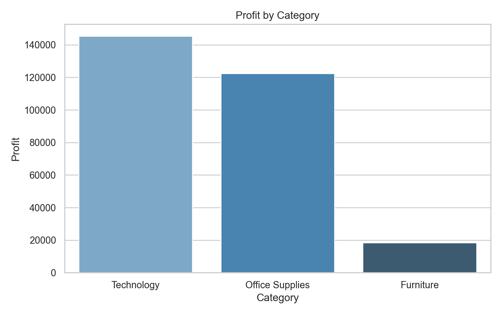
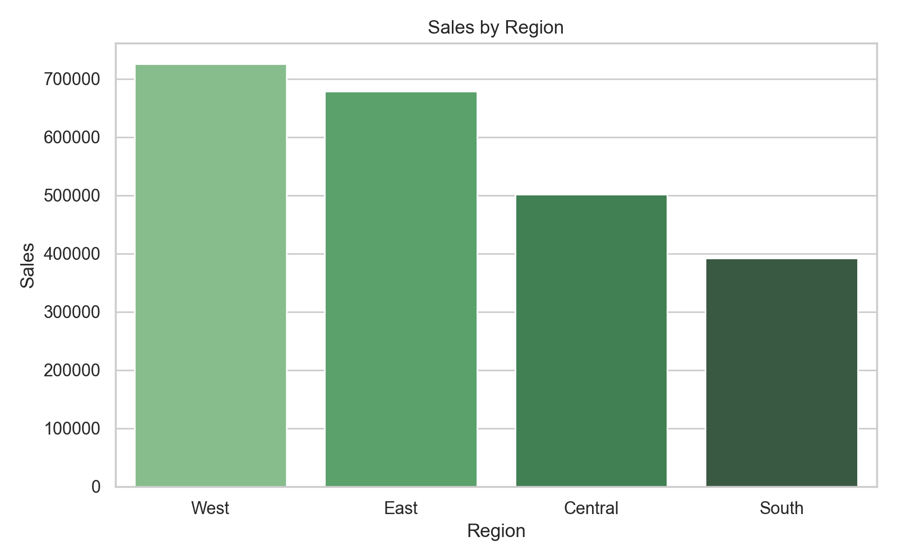
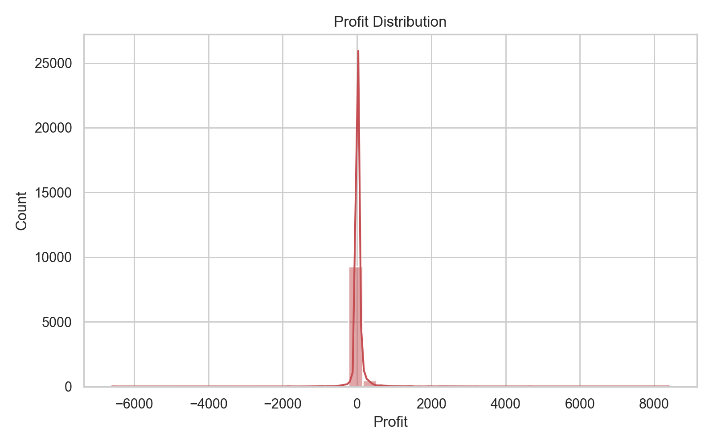

# Superstore Sales Analysis

English | [Русский](README.ru.md)

Exploratory data analysis of a retail sales dataset using Python, pandas, seaborn, and Jupyter. The project focuses on sales performance, profitability, regional trends, and loss-making orders to turn raw transactional data into business insights.

## Project Overview

This project analyzes the `Sample - Superstore.csv` dataset to understand where the business generates revenue, which categories are the most profitable, and where the company may be losing money.

The analysis includes:

- data loading and validation
- missing value and duplicate checks
- sales and profit aggregation
- category and regional analysis
- loss-making order exploration
- visual storytelling with charts

## Business Questions

- Which product categories generate the most profit?
- Which regions lead in sales?
- How many order lines are loss-making?
- Which products bring the highest revenue?
- What patterns can help explain weak profitability?

## Tech Stack

- Python
- pandas
- matplotlib
- seaborn
- Jupyter Notebook

## Dataset

- Source file: `Sample - Superstore.csv`
- Domain: retail sales
- Main fields used: `Sales`, `Profit`, `Category`, `Region`, `Product Name`

## Key Findings

- Total sales: `2,297,200.86`
- Total profit: `286,397.02`
- Most profitable category: `Technology`
- Highest-sales region: `West`
- Loss-making order lines: `1,871`

These findings suggest that revenue is not evenly translated into profit, which makes discount strategy, product mix, and low-performing orders worth deeper investigation.

## Visualizations

### Profit by Category



### Sales by Region



### Profit Distribution



## Repository Structure

```text
.
|-- README.md
|-- README.ru.md
|-- analysis.py
|-- build_project.py
|-- notebook.ipynb
|-- Sample - Superstore.csv
`-- charts/
```

## How to Run

1. Clone the repository.
2. Install dependencies:

```bash
pip install pandas matplotlib seaborn jupyter
```

3. Run the Python script:

```bash
python analysis.py
```

4. Or open the notebook:

```bash
jupyter notebook notebook.ipynb
```

## Project Highlights for Recruiters

- Performed end-to-end exploratory data analysis on a real tabular dataset
- Validated data quality before analysis
- Translated numeric results into business-oriented findings
- Built clean visualizations to support conclusions
- Organized the project into script, notebook, dataset, and chart outputs

## Next Improvements

- add a `requirements.txt` file for reproducibility
- expand the analysis with discount and segment-level insights
- add recommendations for business decision-making
- publish an interactive dashboard version

## Resume-Ready Summary

Conducted exploratory retail sales analysis using Python, pandas, and seaborn. Cleaned and validated transactional data, analyzed profit and sales trends, identified loss-making orders, and created visualizations to communicate business insights.
